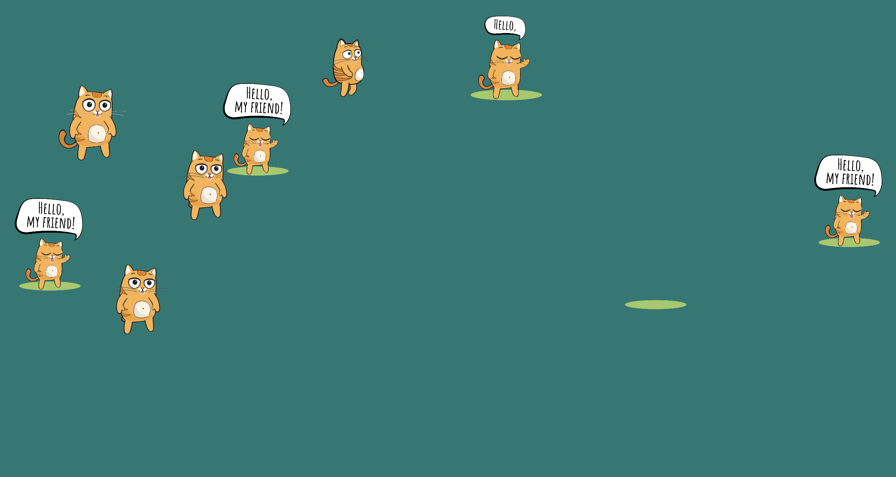
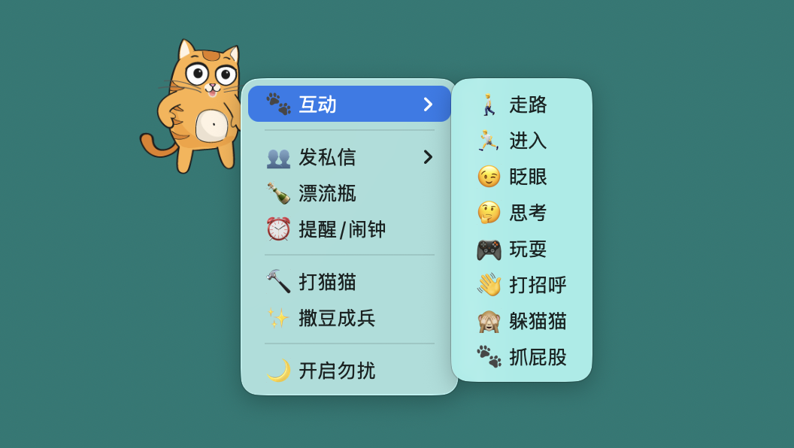
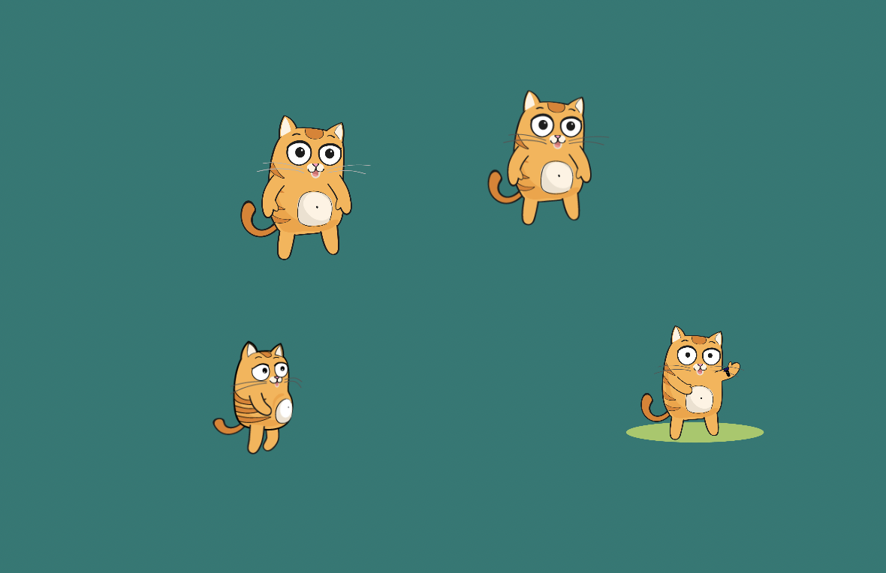
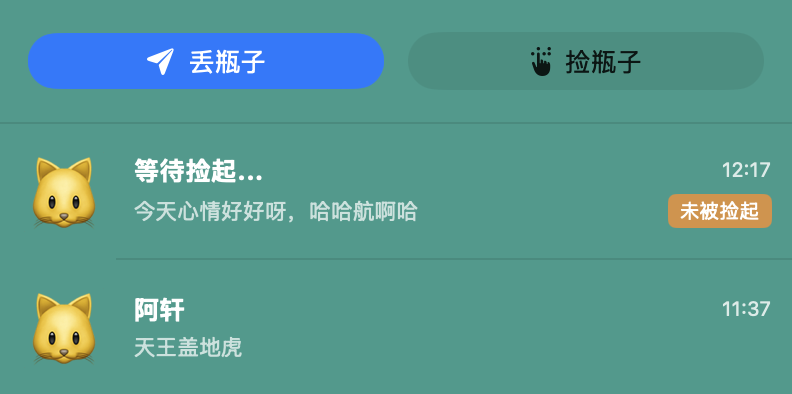
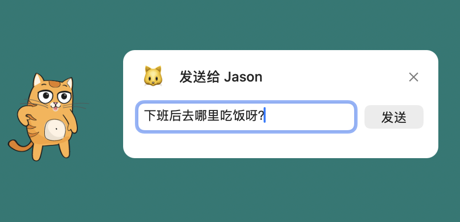

# 🐱 无双猫 - Wushuang Cat

**一只可爱的智能桌面宠物，陪伴你的工作与学习**

[官方网站](https://www.wscat.cn) • [下载安装](#-下载安装) • [功能特性](#-功能特性) • [问题反馈](https://github.com/yhgszi/WushuangCat-Release/issues)

---

## ✨ 功能特性

无双猫是一款功能丰富的 macOS 桌面宠物软件，提供智能提醒、精准闹钟、好友私信、漂流瓶社交、趣味互动等功能。让你的 Mac 桌面更有趣，工作学习更高效。

### 核心功能

- 🎭 **多种动画表情** - 基于 Lottie 的流畅动画，60 FPS 丝滑体验
- 🎮 **打猫猫游戏** - 趣味互动小游戏，工作累了来放松一下
- 🧬 **撒豆成兵** - 一键召唤多只猫猫到桌面，瞬间让屏幕充满生机
- 💬 **漂流瓶社交** - 扔出你的心情，捡起别人的故事，探索未知的惊喜
- 👥 **好友私信** - 添加好友，实时聊天，让桌面宠物成为社交窗口
- ⏰ **智能提醒** - 定时提醒休息、喝水、运动，关心你的健康
- 📅 **精准闹钟** - 支持工作、会议、吃药等多种场景，重要事项不错过
- 🖱️ **可拖拽移动** - 自由拖拽到桌面任意位置，想放哪就放哪
- 🪟 **多窗口管理** - 智能窗口管理，多个功能互不干扰
- 📊 **低资源占用** - CPU 占用 < 10%，内存占用 < 100MB，不影响工作

---

## 📦 下载安装

### 系统要求

- **操作系统**: macOS 14.0 或更高版本
- **处理器**: Apple Silicon (M1/M2/M3/M4) 或 Intel
- **磁盘空间**: 约 20 MB

### 最新版本

**当前版本**: v0.0.6 | **发布日期**: 2025-10-17

### [⬇️ 点击下载无双猫 v0.0.6](https://github.com/yhgszi/WushuangCat-Release/releases/download/v0.0.6/WushuangCat-v0.0.6.dmg)

### 安装步骤

1. 下载上方的 DMG 文件
2. 双击打开 DMG 文件
3. 将「无双猫」拖到「应用程序」文件夹
4. 首次打开可能需要在「系统设置 > 隐私与安全性」中允许运行

> **提示**: 如果遇到「无法打开，因为 Apple 无法检查其是否包含恶意软件」，请右键点击应用 → 选择「打开」→ 再次点击「打开」按钮。

---

## 🎯 功能展示

### 🐱 主界面

---

### ⏰ 智能提醒与精准闹钟

<table>
  <tr>
    <td width="50%">
      
      
<b>智能提醒</b> 定时提醒休息、喝水、运动

    </td>
    <td width="50%">
      
      
<b>精准闹钟</b> 支持多种场景，重要事项不错过

    </td>
  </tr>
</table>

---

### 🎮 趣味互动

<table>
  <tr>
    <td width="50%">
      
      
<b>趣味互动</b> 可爱动作和表情，支持拖拽点击

    </td>
    <td width="50%">
      
      
<b>撒豆成兵</b> 一键召唤多只猫猫到桌面

    </td>
  </tr>
</table>

---

### 💬 社交功能

<table>
  <tr>
    <td width="50%">
      
      
<b>漂流瓶社交</b> 扔出心情，捡起别人的故事

    </td>
    <td width="50%">
      
      
<b>好友私信</b> 添加好友，实时聊天

    </td>
  </tr>
</table>

---

## 🔄 更新日志

查看 [CHANGELOG.md](./CHANGELOG.md) 了解详细的版本更新历史。

### v0.0.6 (2025-10-17)

✨ **新增功能**
- 好友私信功能，实时聊天
- 打猫猫互动游戏
- 撒豆成兵功能，一键召唤多只猫猫

🐛 **问题修复**
- 修复多窗口管理导致的崩溃问题
- 修复敏感词过滤问题

🎨 **优化改进**
- 优化 Lottie 动画性能和流畅度
- 改进日志系统

---

## 💬 反馈与支持

### 问题反馈

遇到问题或有功能建议？欢迎通过以下方式联系我们：

- 🐛 [报告 Bug](https://github.com/yhgszi/WushuangCat-Release/issues/new?template=bug_report.md)
- 💡 [功能建议](https://github.com/yhgszi/WushuangCat-Release/issues/new?template=feature_request.md)
- 💬 [参与讨论](https://github.com/yhgszi/WushuangCat-Release/discussions)

### 联系方式

- 🌐 官方网站: [www.wscat.cn](https://www.wscat.cn)
- 📧 邮箱: sh1382378@gmail.com

---

## 📄 许可证

本项目采用 [MIT License](./LICENSE) 开源许可。

---

## ⚠️ 免责声明

本软件按"原样"提供，不提供任何明示或暗示的保证。使用本软件所产生的任何风险由用户自行承担。

---

## 🙏 致谢

感谢所有使用无双猫的用户，你们的支持是我们持续改进的动力！

---

**让工作不再孤单，无双猫陪伴你** ❤️

Made with ❤️ by [yhgszi](https://github.com/yhgszi)

Copyright © 2024-2025 无双猫. All rights reserved.

